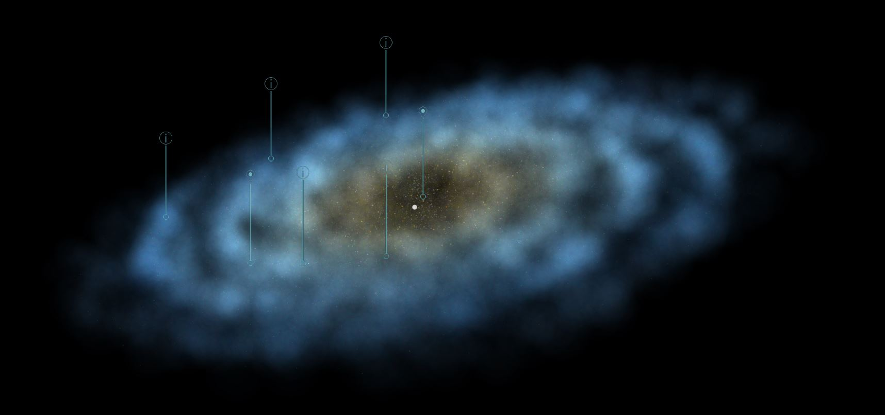
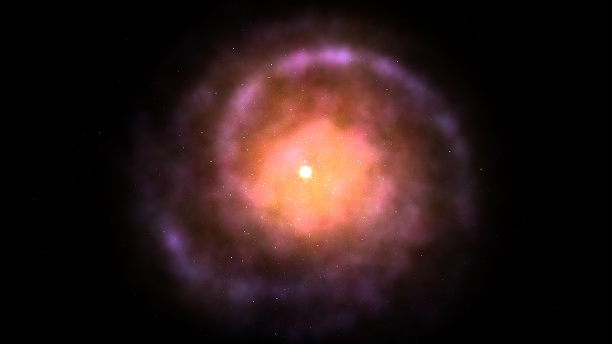
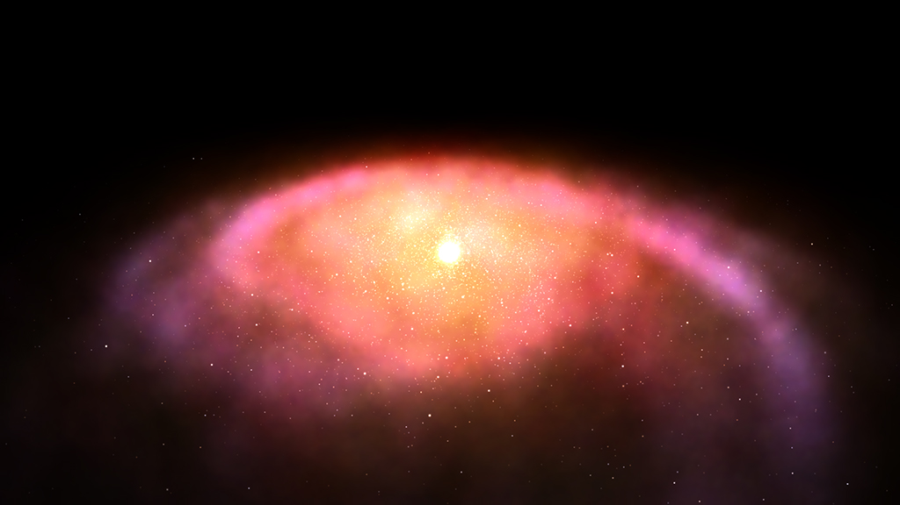
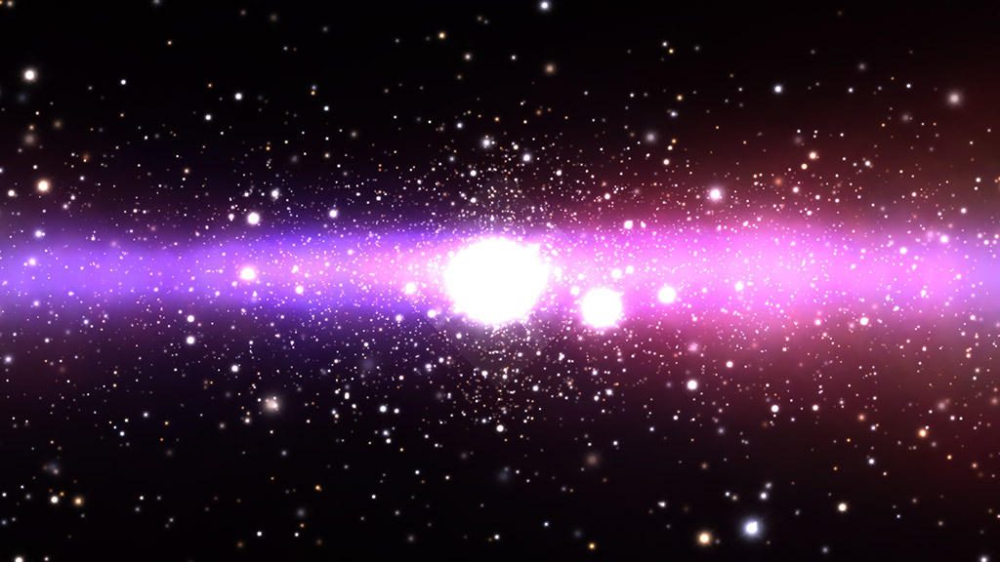

One of the points I mentioned in the last entry was finishing up the system for traveling across the galaxy. While trying to design the system, I realized my current galaxy rendering technique isn't good enough anymore.

The previous system was quite simple. Every generated star, hydrogen cloud or cloud of dust particles had a specific temperature. Based on that temperature and some tweaking the system picked a color and a proper sprite and rendered it into render texture which was used on a plane.
This made however the galaxy seem very flat and the rendering wasn't efficient enough to animate the galaxy. Not mentioning the horrific pixelization while zooming in.

So I embarked on a journey to create a better system.

After a few failed attempts, where I tried to use Unity's instanced rendering to render 30 000 inverse cubes with particle shader, which bombed the performance quite a bit, I resorted to the holy grail of every development process: Google ... or rather DuckDuckGo. 

What I in the end found was [Microsoft/GalaxyExplorer](https://github.com/Microsoft/GalaxyExplorer) repository containing a unity project for Microsoft HoloLens which lets you explore the Milky way galaxy. I encourage you to download it and try it out. It just looks amazing.

What I wanted to find out is how they managed to render the galaxy with so much detail and even with option to zoom in a see the stars moving around.

*Screenshot from the Galaxy explorer.*

## So how did they do it?

Located [here](https://github.com/Microsoft/GalaxyExplorer/blob/master/Assets/Galaxy/DrawStars.cs) is a file containing the main rendering logic. The most interesting class is the `DrawStars` MonoBehaviour. In the game scene there are three instances of it.

- For rendering stars
- For rendering hydrogen clouds
- For rendering black spots for debris or other mess

There are two modes in which the rendering process operates. It either renders into downscaled texture or not. The rendering into a downscaled texture is used for hydrogen clouds and those black spots.

Let's start with the simplest one, rendering stars.

Stars are rendered using the `Graphics.DrawProcedural` method located [here](https://github.com/Microsoft/GalaxyExplorer/blob/master/Assets/Galaxy/DrawStars.cs#L247) and a shader located [here](https://github.com/Microsoft/GalaxyExplorer/blob/master/Assets/Galaxy/SpiralStarsShader.shader). The input is an array of `StarVertDescriptor` structs which contain color, size, uv (for selecting a sprite from spritesheet) and data required for calculating position, because they also calculate position in the vertex shader.

Inside the `SpiralStarsShader` you can find a geometry shader which, based on the position data calculated in the vertex shader, creates a plane that is always rotated towards the main camera.

Then the fragment shader calculates the appropriate color based on the input texture and color of an individual star.

Clouds are rendered in a very similar way using a `SpiralStarsCloudShader` located [here](https://github.com/Microsoft/GalaxyExplorer/blob/master/Assets/Galaxy/SpiralStarsCloudShader.shader) but instead of directly rendering it onto a screen, it renders it into a render texture.

Before the rendering starts, a singleton of `RenderTexturesBucket` is created. This class instance contains three render textures with different resolutions from low to high.

When rendering into a downscaled target, it first sets the target render texture to the low resolution render texture from the `RenderTexturesBucket` [here](https://github.com/Microsoft/GalaxyExplorer/blob/master/Assets/Galaxy/DrawStars.cs#L179). Then it goes through the same process as when rendering stars and renders the clouds with `Graphics.DrawProcedural` method. This time into a render texture. Then using `Graphics.Blit` method and bilinear filtering it upscales the texture with the first pass of the `ScreenComposeShader` located [here](https://github.com/Microsoft/GalaxyExplorer/blob/master/Assets/Galaxy/ScreenComposeShader.shader) into the medium resolution render texture and finally, using the same approach, into the high resolution render texture. This approach saves performance and also doesn't produce artifacts, which would occur if they were using the low res texture for the final stage of rendering.

Then finally they render a cube with the high res render texture projected onto the cube. This all happens in either the second or third pass of the `ScreenComposeShader`. The second pass is used for rendering in the game view or in the final build. The third pass is used for rendering in the scene view. This cube needs to be large enough to contain the entire galaxy. (Pretty large huh?)

After a couple of days of tweaking and tinkering I was able to use the same approach in my ECS setup which produced the following results.

And a little twinkling for effect.

<video autoplay loop>
  <source src="assets/twinkling.mp4" type="video/mp4">
</video>

In the end I kept all the color and position generating systems. The only thing I adopted is the above described rendering approach

Next step is to actually do the travel system.