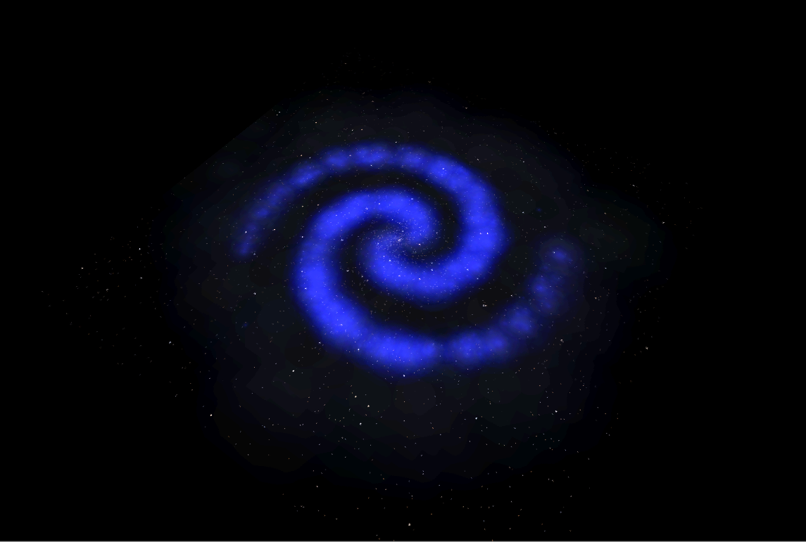
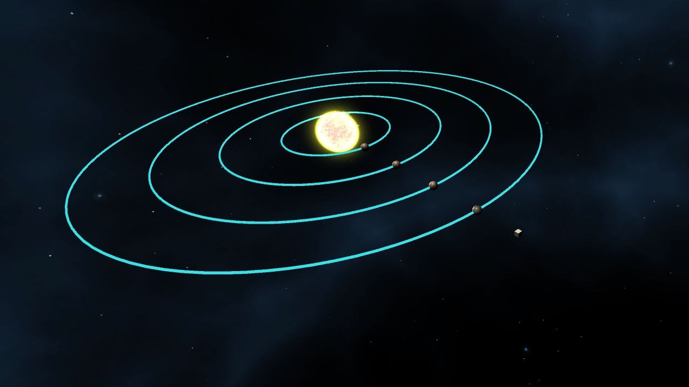
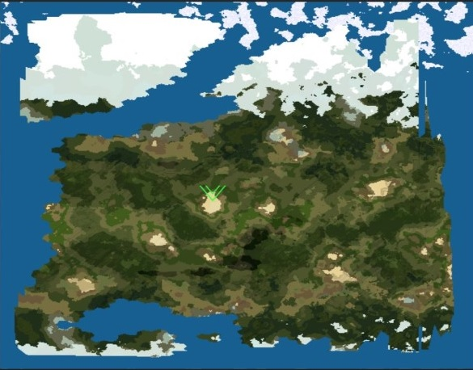
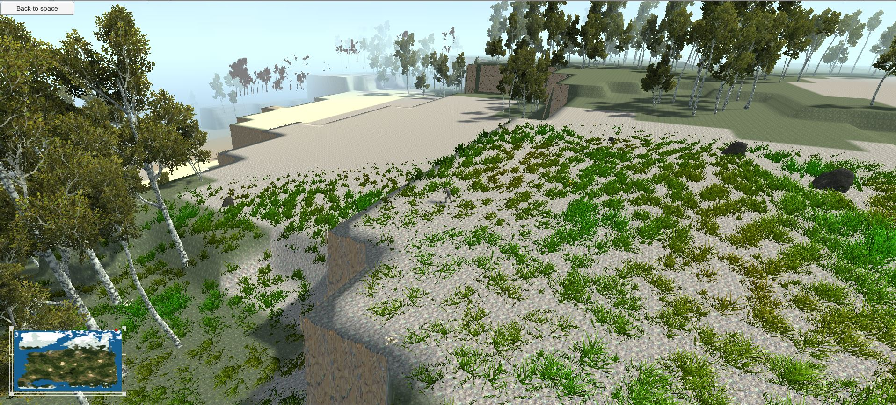
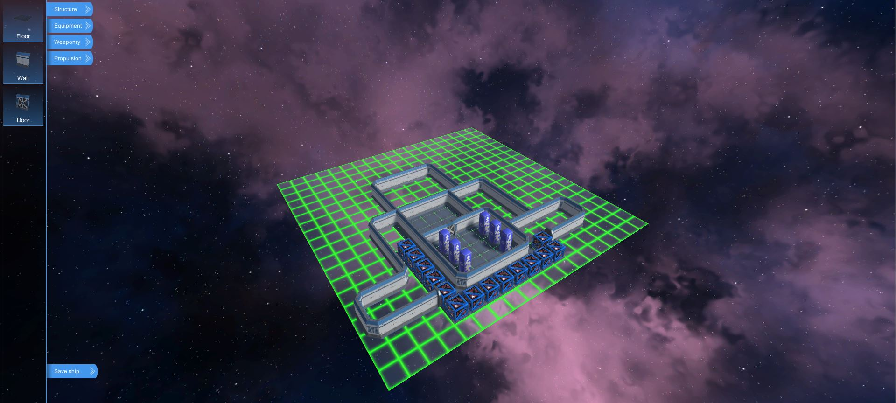
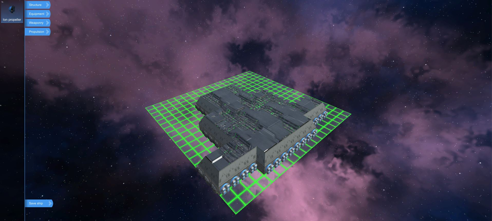
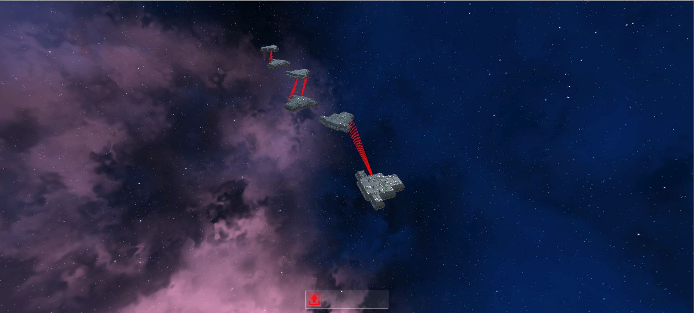
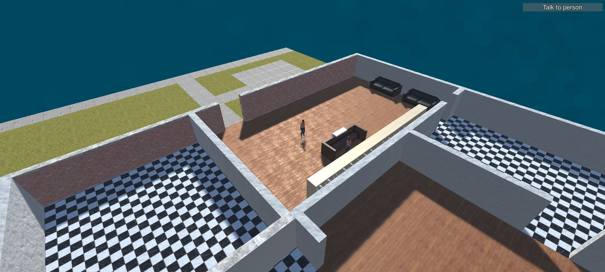

Two years ago I had a bright idea to write a video game. It wasn't my first. I've been getting these kinds of bright ideas once every couple of months. What makes this one so special is that it's the first idea that stuck with me for more than a week, significantly more.

I decided it might be also a good idea to write a devlog. I do need to channel all my game thoughts somewhere and this seems to be like a good place to do it. This first part will be dedicated to an overview of the current state.

*Just a little disclaimer: game development isn't my full time job so everything I'm going to describe was done after working hours, during weekends, vacations etc.*

Since I'm more software developer than anything else, this whole thing will be more leaned towards software development details.

## The Game

Lifeless frontier is procedurally generated RPG/strategy game taking place in a distant future where humanity doesn't longer possess the need for their biological shells. Instead, they live in simulations powered by a huge swarm of computers or in solitude exploring the Milky way galaxy.

The player will be one of these transcended individuals tasked to oversee construction of project called “space highways” which are lasers built in strategically selected solar systems powered by a local [Dyson swarm](https://en.wikipedia.org/wiki/Dyson_sphere). Thanks to [radiation pressure](https://en.wikipedia.org/wiki/Radiation_pressure) these lasers are able to propel and slow down vessels traveling from one solar system to another.

### Galaxy construction 101

Procedural generation is one of the key points in this game and there are several levels of it.

Using theory called the [Density wave theory](https://en.wikipedia.org/wiki/Density_wave_theory) the game places all the stars in a believable pattern. Then for each star the games selects appropriate mass which then reflects on how hot the star is which then determines its color and luminosity.

Then the game picks a number of random stars and generates planets around those stars. Based on certain criteria and chance it can generate one of the following planet types:

- Gas giant,
- Asteroids (for an asteroid belt instead of planet)
- Rock
- Water
- Ice
- Terrestrial
- Venusian
- Martian

Terrestrial planets are very special because they can be landed on. Every terrestrial planet has these following steps in order to generate it.

1. Selecting random points on a sphere and using flood fill to determine lithosphere
2. Selecting an ocean level
3. Calculating temperature based on a distance from the equator
4. Calculating precipitation, irrigation, humidity, permeability, ice caps and finally the appropriate biomes using [Holdridge life zones model](https://en.wikipedia.org/wiki/Holdridge_life_zones).

This approach was heavily inspired by a library called [WorldEngine](https://github.com/Mindwerks/worldengine)

Currently the game generates also landscape that can be traversed by the player but this system is subject to further development. As you can see, it looks quite ugly right now.

### A ship adequate to the voyage

To traverse this vast space you need a ship and I always liked the idea of creating my own ship. That was in fact one of my key points when designing the game. Currently it features an editor where the player has an option to design a ship from scratch.

After placing interior the player can switch into exterior view and place weapons, propellers or other systems. Model of the ship is automatically generated from its designed layout. For this process I utilized slightly modified version of [marching squares](https://en.wikipedia.org/wiki/Marching_squares) algorithm to get the layout boundaries.

After getting the boundaries, a model is generated, UV unwrapped and cached for further use.

Every each component you put onto your ship has its own weight and other properties that influence how your ship is going to be fast or agile.

The game AI can build their own ships as well based on a given parameters like firepower and acceleration the algorithm calculates how many guns, engines, reactors and of what kind are required to suffice this constrains. The algorithm used for this is the [simplex algorithm](https://en.wikipedia.org/wiki/Simplex_algorithm). Then a sprinkle of magic and a huge dose of guesswork is used to actually generate the ship's structure.

On enemy encounter the player shall be moved to the battle view where (s)he assumes control over a number of spaceships inside the player's squad. Every battle can be paused and orders given at the player's own pace.

### Blend with handcrafted content

Purely procedural content could be quite boring in this case so I'm trying to work on a system which could blend procedural and handcrafted content in connection to quests. This system is in very early stages.

## The plan

So what's next? Above we've seen a lot of disconnected features. My next milestone is to connect them to a playable version containing the following functions.

- Procedural generation as it is right now
- Spaceship editor with resource consumption
- Fully fledged system for moving across the galaxy including fuel consumption
- Procedurally generated AI squads waiting in certain systems
- Battle system that's not that clunky as it is today.
- Single mission to get from point A to B